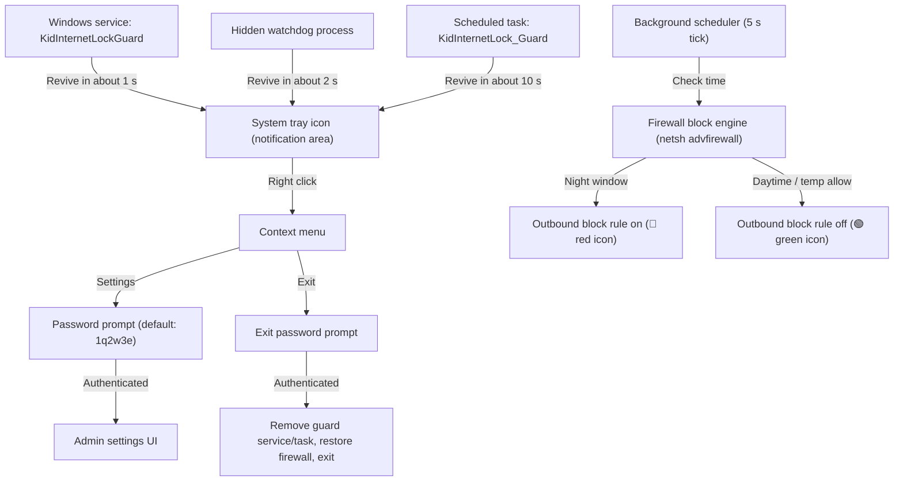

# 🌙 Kid Internet Lock

> A lightweight Windows system-tray application that automatically blocks the internet during set late-night hours to help prevent kids from staying online too late.
> Written **100% in Rust** with no Python runtime or external DLL dependencies — it ships as a **single standalone executable (~0.5 MB)**.

---

## 📌 Features

1. **Scheduled nightly internet blocking**
   - Default block window: **00:00 – 07:00** every night
   - Windows crossing midnight (e.g. 23:30 – 06:30) are fully supported
   - Blocking starts automatically at the configured time and is lifted automatically when the window ends

2. **Windows system-tray resident**
   - Lives in the notification area (next to the clock) without covering the screen
   - Live status icons: 🟢 internet allowed / 🔴 internet blocked
   - Hover tooltip shows the current state and the next block/release time

3. **Admin authentication and security**
   - Default password: `1q2w3e`
   - Authentication is required to open settings, grant temporary access, toggle blocking, or exit the app
   - Passwords are stored as salted SHA-256 hashes
   - Password fields **always accept English input** — the Korean IME is detached from password boxes, so there is no Hangul/English toggle to worry about

4. **Tamper-resistant**
   - Cannot be terminated from Task Manager: a privileged Windows service (`KidInternetLockGuard`) relaunches the app within about a second
   - Backed by a hidden in-session watchdog process (~2 s recovery) and a scheduled task (~10 s recovery) so it comes back even if every process is killed at once
   - The app can only be closed through the password-protected tray menu, and a normal exit removes all guard mechanisms

5. **Friendly admin settings UI**
   - Change block start/end times (hour/minute)
   - Temporary allow for 30 or 60 minutes (for emergencies or homework)
   - "Block / unblock now" manual toggle
   - Change the admin password
   - Register/unregister auto-start at Windows logon (Windows Task Scheduler with `HighestAvailable` privileges, eliminating UAC prompts at boot)

6. **Reliable blocking mechanism**
   - Controls Windows Firewall outbound rules instead of powering off network hardware (Wi-Fi/LAN)
   - Automatically enables the Windows Firewall profiles (domain/private/public) before applying rules, so blocking also works on public networks where the firewall had been turned off
   - Applies in about a second with no Wi-Fi reconnection delay
   - Rules stay in place even if the app is killed mid-window, so they cannot be bypassed
   - On a normal exit the rules are removed after admin authentication

---

## 🛠 Architecture



---

## 📂 Project layout (Rust)

| File / Directory | Description |
| :--- | :--- |
| `src/main.rs` | Entry point: CLI modes (`--service`, `--watchdog`, `--silent`), single-instance mutex, UAC elevation |
| `src/tray.rs` | Win32 system-tray icon, mouse events, context menu, message loop, exit flow |
| `src/firewall.rs` | Windows Firewall outbound block/unblock engine (`netsh advfirewall`) including profile auto-enable |
| `src/scheduler.rs` | Block-window evaluation (midnight crossing support), temporary allow, manual override, apply/retry logic |
| `src/config.rs` | Configuration load/save (`config.json`), SHA-256 salted password hashing, autostart registry |
| `src/icon.rs` | High-resolution green/red status icons rendered with GDI (no image files) |
| `src/admin.rs` | Administrator privilege check and `runas` self-elevation |
| `src/single_instance.rs` | System-wide `CreateMutexW` single-instance guard |
| `src/watchdog.rs` | Hidden mutual watchdog process and keep-alive scheduled task |
| `src/service.rs` | `KidInternetLockGuard` Windows service that instantly revives the app |
| `src/ui/mod.rs` | UI module declarations |
| `src/ui/font.rs` | Applies the Malgun Gothic UI font to controls |
| `src/ui/ime.rs` | Detaches the IME so password fields always receive English input |
| `src/ui/password_dialog.rs` | Modal admin password dialog (masking, Enter/Esc shortcuts) |
| `src/ui/settings_dialog.rs` | Admin settings window: schedule, temporary allow, manual control, password change, autostart |
| `app.manifest` | Windows application manifest (Windows 10/11 compatibility, DPI awareness) |
| `build.rs` | Windows resource/manifest build script |
| `Cargo.toml` | Rust dependencies and package metadata |
| `run.bat` | Convenience launcher |
| `build.bat` | Release build script that produces `KidInternetLock.exe` |

---

## 🚀 Usage

1. **Run**
   - Download `KidInternetLock.exe` from the [Releases page](../../releases/latest) and double-click it (or build it yourself and use `run.bat`).
   - Approve the **UAC (User Account Control)** prompt — administrator rights are required to control Windows Firewall.
   - If the app is already running, a notice appears asking you to check the tray area; duplicates are prevented.

2. **Tray**
   - A green shield icon appears in the notification area (bottom-right, next to the clock).
   - Hover over it to see the current state and the next block time.
   - Double-click the icon (or right-click ➔ settings) to authenticate and open settings.

3. **Settings**
   - Right-click the tray icon ➔ **[Admin Settings (S)...]**
   - Enter the password (default `1q2w3e`) and press Enter.
   - Configure the block window, change the password, and enable/disable auto-start.

4. **Temporary allow**
   - Right-click the tray icon ➔ **[Allow 30 Minutes]** or **[Allow 1 Hour]**
   - Authenticate and the internet is temporarily allowed even during the block window.

5. **Exit**
   - Right-click the tray icon ➔ **[Exit (X)]** ➔ enter the admin password.
   - On exit, the guard service, watchdog and scheduled task are removed, and the firewall rules are restored.

### Notes and troubleshooting

- The app enables the Windows Firewall profiles while blocking. If the firewall was off, it is turned back on automatically so the rules take effect. Windows Firewall does not terminate connections that were already established, so an app that is already online may keep working for a short while — close and reopen it to test.
- If blocking fails (e.g. security policy blocks firewall changes), the tooltip and settings window show **⚠️ Failed to apply firewall rule**, and the app keeps retrying.
- To remove the guard components manually from an elevated command prompt:
  ```
  sc delete KidInternetLockGuard
  schtasks /Delete /F /TN KidInternetLock_Guard
  ```
- If the executable is moved or deleted, the scheduled task and service point to the old path; remove them with the commands above.

---

## 🧱 Building from source

Requirements: Windows and a recent stable Rust toolchain (edition 2024).

```
build.bat
```

or

```
cargo build --release
```

The output is `target\release\kid_internet_lock.exe`; `build.bat` also copies it to `KidInternetLock.exe`.

---

## ⚠️ Disclaimer

This tool is intended for parents to manage their own computers and home networks. Use it only on devices you own or are responsible for.
